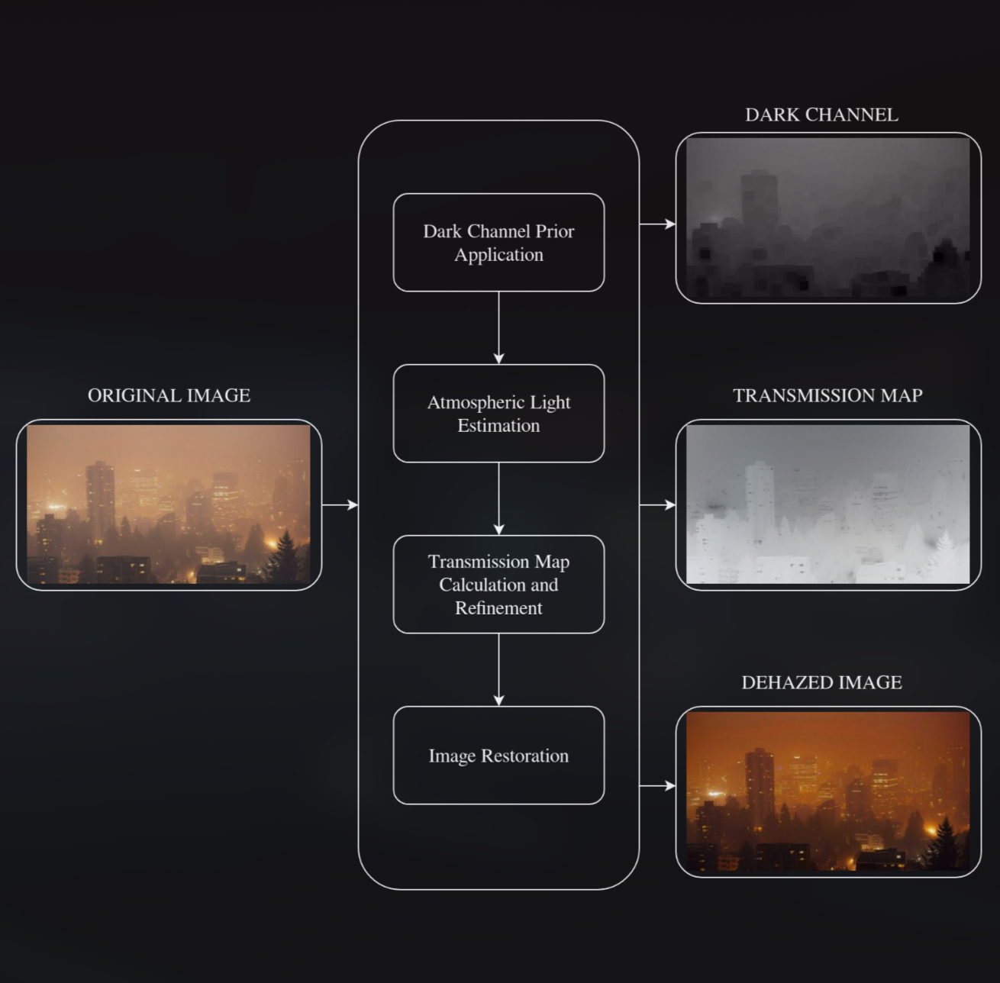

# IMAGE DEHAZER

This project implements an image dehazing/defogging algorithm based on the Dark Channel Prior technique proposed by He et al. (2011). The dehazer features a simple and intuitive user interface to process foggy images, producing clearer outputs with minimal distortions.

Developed as part of the **Signal, Image, and Video** course for the academic year **2024/2025**, this project could serve as a baseline for more advanced algorithms, such as real-time monitoring systems, where clear visibility in perturbed environments is crucial.

## TABLE OF CONTENTS

- [Architecture](#architecture)
- [Procedure](#procedure)
- [Contributors](#contributors)
- [Refrences](#references)

## ARCHITECTURE

The algorithm follows a structured four-step approach to dehaze images effectively:

1. **Dark Channel Prior Application** – The input image is processed using the Dark Channel Prior method to estimate the presence of haze.
2. **Atmospheric Light Estimation** – The global atmospheric light is estimated based on the dark channel results.
3. **Transmission Map Calculation and Refinement** – The transmission map is computed using a spectral transform method to determine the haze density. It is then refined using the **Guided Filtering** method to ensure smoother transitions and more accurate haze removal.
4. **Image Restoration** – The refined transmission map and estimated atmospheric light are used to recover a clear, haze-free image.

The process is summarized in the diagram below:



## HOW TO RUN

To set up and run the project on your local environment, follow these steps:

1. Clone the repository:
   ```sh
   git clone https://github.com/BalestrixAIS/SIV.git
   ```
2. Install the required dependencies:
   ```sh
   pip install -r requirements.txt
   ```
3. Navigate to the folder containing cli_tool.py and run the    script with the following command:
   ```sh
   python cli_tool.py
   ```
4. Insert the path to the image you want to process as input:
   ```sh
   <path_to_image>
   ```

Replace "path_to_image" with the full path to the image you want to dehaze.

After the program finishes processing, the dehazed image will be saved in the "processed_images" folder.

## CONTRIBUTORS

- Stefano Camposilvan - AIS student, ID: 257848

- Valeria Mayora Barcenas - AIS student, ID: 257843

## REFERENCES

### REPOSITORIES
[arjundixit98, Defogging-Images-using-Dark-Channel-Prior](https://github.com/arjundixit98/Defogging-Images-using-Dark-Channel-Prior.git)

[ishitapatil08, De-Smoking-De-Hazing-Algorithm](https://github.com/ishitapatil08/De-Smoking-De-Hazing-Algorithm.git)

[dpatel698, Image-Dehazer](https://github.com/dpatel698/Image-Dehazer.git)

### PAPERS
[Single Image Haze Removal Using Dark Channel Prior, He et. al (2011)](https://projectsweb.cs.washington.edu/research/insects/CVPR2009/award/hazeremv_drkchnl.pdf)